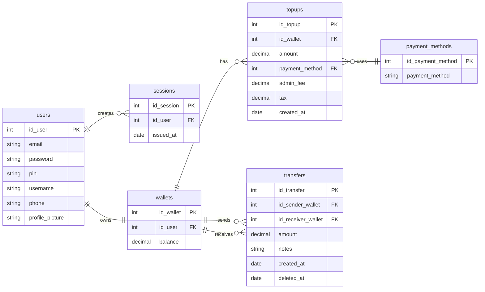

```mermaid
erDiagram
direction LR

  users ||--o{ sessions : creates
  users ||--|| wallets : owns
  wallets ||--o{ topups : has
  topups }o--|| payment_methods : uses
  wallets ||--o{ transfers : sends
  wallets ||--o{ transfers : receives

  users {
        int id_user PK 
        string email
        string password
        string pin
        string username 
        string phone
        string profile_picture
    }

  sessions {
      int id_session PK
      int id_user FK
      date issued_at 
  }

  wallets {
      int id_wallet PK
      int id_user FK
      decimal balance
  }

  topups {
    int id_topup PK
    int id_wallet FK
    decimal amount
    int payment_method FK
    decimal admin_fee
    decimal tax
    date created_at
  }

  payment_methods{
    int id_payment_method PK
    string payment_method
  }

  transfers {
    int id_transfer PK
    int id_sender_wallet FK
    int id_receiver_wallet FK
    decimal amount
    string notes
    date created_at
    date deleted_at
  }


```